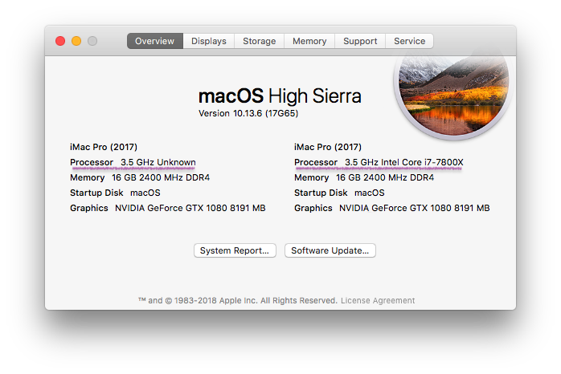

Set the "Unknown" processor kind for "About This Mac", depending on your preference. This is just a decoration.



Get the script and give it executable permissions:
```bash
curl -o cosmetiCPUKind.sh -fsSL https://raw.githubusercontent.com/Fansaly/CosmetiCPUKind/master/cosmetiCPUKind.sh
chmod +x cosmetiCPUKind.sh
```

Get CPU brand in macOS and set it:
```bash
sudo ./cosmetiCPUKind.sh
```

Custom CPU Kind:
```bash
sudo ./cosmetiCPUKind.sh -u "Intel Core iX-9900X"
```

Reset:
```bash
sudo ./cosmetiCPUKind.sh -r
```
